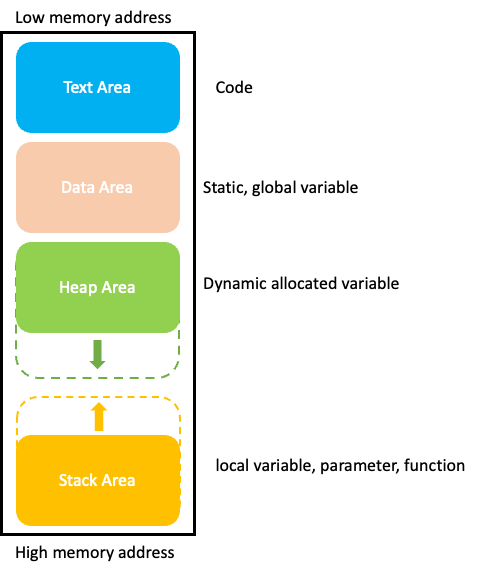

# CHAPTER  02. 변수와 타입

## 기존에 몰랐던 것

### 1. JAVA에서의 변수 선언과 초기화

* **C와 다른 JAVA에서의 변수 선언과 초기화**
    * C에서는 변수를 선언하고 초기화 하지 않아도 메모리 공간(Stack 영역)에 할당이 되고 실제 해당 메모리 공간에는 Garbage value(학교에서는 이렇게 쓰레기 값이라고 표현했는데, 맞는 표현인지
      모르겠음)가 저장되어있어 컴파일이 되고, 실제 런타임시에 에러가 발생하는 경우가 방심하는 순간 많았는데, JAVA에서는 애초에 초기화하지 않으면, 메모리 공간에 할당이 되지 않고, 컴파일 시 에러가
      발생시켜, 이러한 문제를 방지하는 것이 흥미로웠습니다.

## 알면 좋을 것

### 1. 프로그램과 프로세스의 차이

* **프로그램**은 특정 태스크를 수행하기 위해 조합된 명령어의 집합을 의미하며, HDD, SSD와 같은 secondary device에 저장되어 있다.
* **프로세스**는 프로그램이 메모리에 load되어 cpu에 의해 실행되는 job을 의미한다.

### 2. 프로세스의 메모리 공간

 
위의 그림은 프로세스가 어떻게 OS가 할당해준 메모리 공간을 사용하는지 나타낸 아주 간단한 그립이다.

1. **Text 영역**에는 프로그램을 구성하는 코드가 저장되어 있어, 프로세스가 시작하고 끝날 때까지 메모리의 Text Area에 계속 존재하게 된다.
2. **Data 영역**에는 프로그램에서 사용되는 전역변수과 static 변수들이 저장되어 있으며, 프로세스가 시작할 때 할당되며, 종료시 할당 해제가 된다.
3. **Heap 영역**에는 runtime시 동적으로 할당되는 변수 혹은 객체가 공간을 할당받아 저장되게 되며, 사용을 더 이상하지 않으면, 할당 해제 되는 영역이다. JAVA에서는 할당과 해제를 JVM이 해주고,
   C언어에서는 malloc, calloc, realloc 등과 같은 함수를 사용하여 Heap 영역에 공간을 할당하고, free 함수를 통해 할당 해제한다.
4. **Stack 영역**에는 complile시 크기가 결정되며, 함수 호출과 관계가 있는 매개변수와 지역변수들이 저장된다. 이러한 변수들은 함수가 호출되면 stack영역에 push하고, 함수의 수행이 완료되면
   stack영역에서 pop되어 소멸하게 된다. 그리고 heap영역에 동적으로 할당된 변수 혹은 객체의 주솟값을 저장하고 있는 영역도 Stack 영역이다.

### 3. 2의 보수

컴퓨터의 기본적으로 데이터를 이진수(binary)로 읽는다. 이진수는 모든 숫자를 0 과 1로 표현한다. 하지만 단순히 이진수라고 하면 음수는 어떻게 표현하는지 관심을 가지지 않는 경우가 있다.
이진수에서 음수를 표현하는 방식으로는 1의 보수와 2의 보수가 있다. (사실 1의 보수는 사용하지 않는다.)

* 보수란? 보수는
  1의 보수
  Integer(정수):

Floating Point(부동 소수점):
실수간 비교가 부정확한 이유를 알 수 있음.

Promotion, Casting 과정.